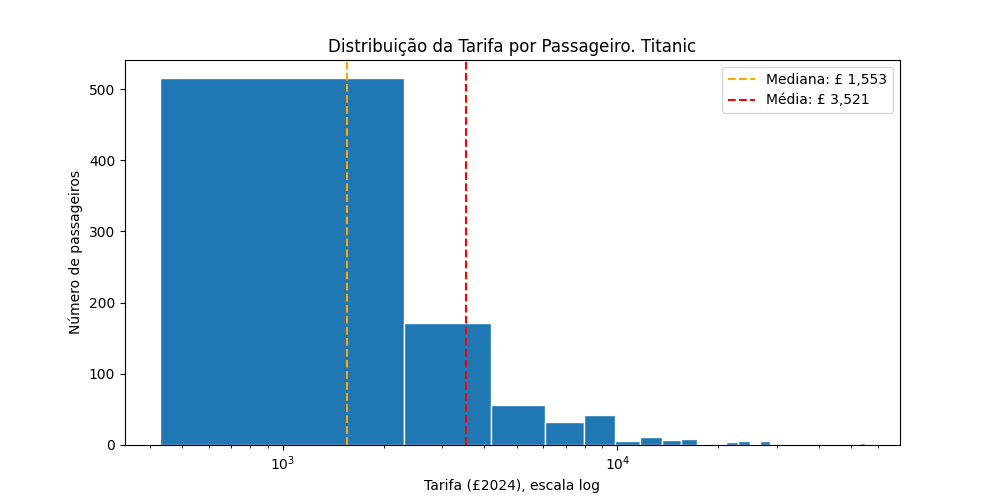
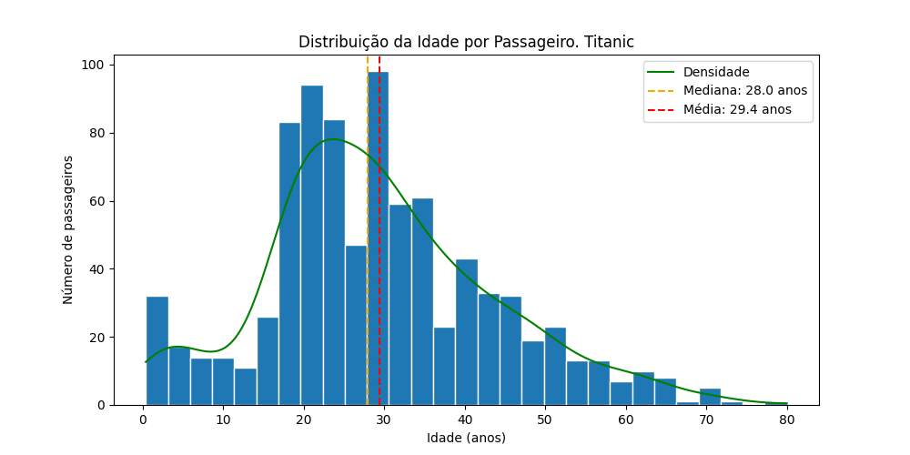
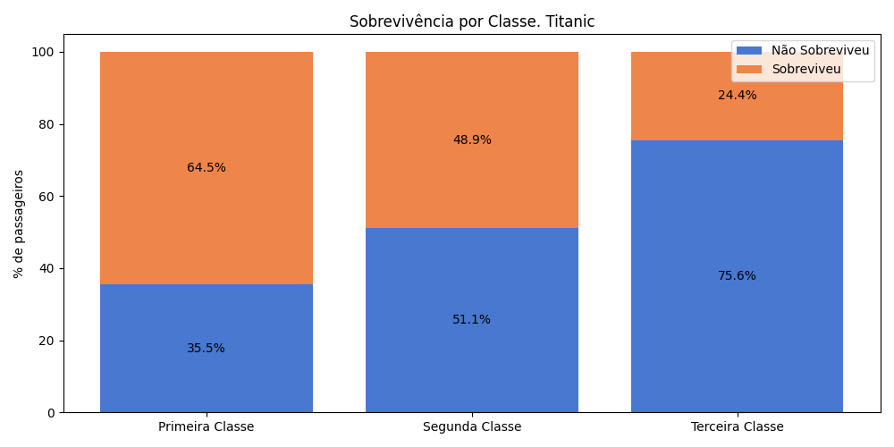
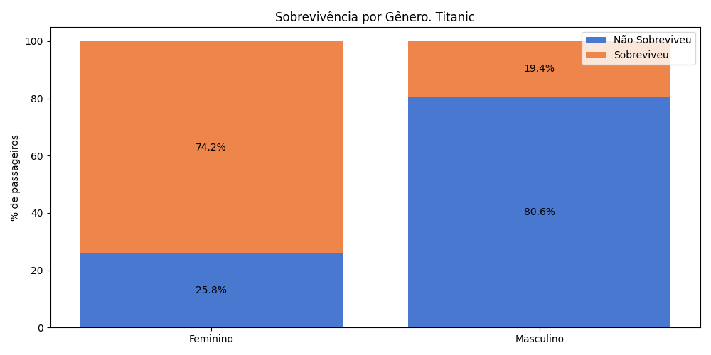
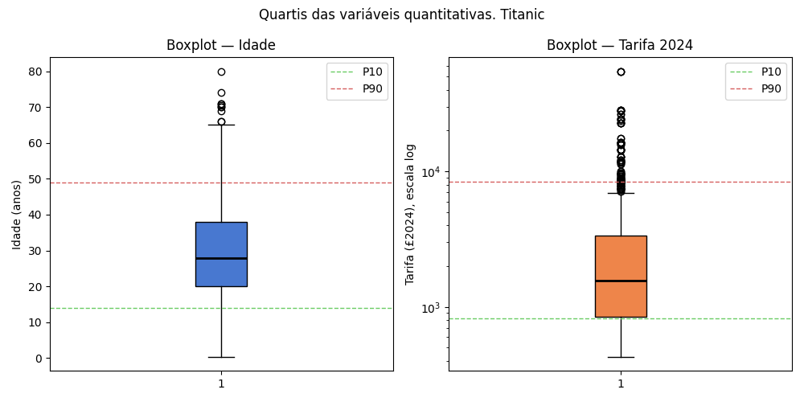
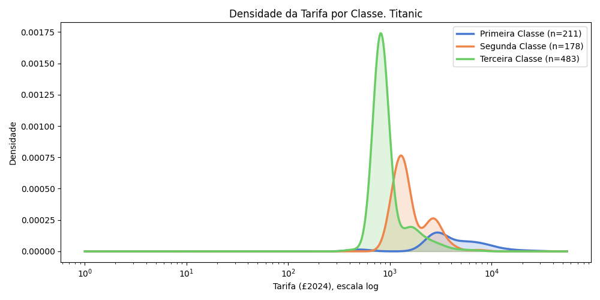

# MBA Descriptive Statistics — D1 Titanic and D2 Brazilian Elections

Final Project for the **Descriptive Statistics** course of the MBA in Data Science.

## Objective

Apply descriptive statistics concepts to two real-world datasets: the Titanic passenger dataset and Brazilian electoral campaign finance data. The analysis covers measures of central tendency, dispersion, and separatrices, as well as bar charts, histograms, scatter plots, Pearson correlation, and logarithmic scale.

---

## D1 — Titanic

### Data

- Source: Titanic passenger dataset
- 887 total records, 8 original variables
- **15 records with Fare = 0 were intentionally removed**, leaving 872 passengers for analysis. These records correspond to crew members or complimentary passengers whose fare was not applicable. Keeping them would distort fare-based statistics (mean, median, distribution) and inflate the inflation-corrected figures
- Key variables: Age, Fare, Sex, Pclass, Survived
- Feature engineering: fares corrected for inflation to 2024 values using Bank of England CPI (1912 to 2016) and World Bank CPI (2016 to 2024), resulting in a ~107x correction factor; age group variable created (Criança, Jovem, Adulto, Idoso)

### Notebook Structure

1. Imports and constants
2. Loading and preparation (inflation correction, age groups)
3. Exploratory analysis
   - 3.1 Dataset overview (describe)
   - 3.2 Variable identification
   - 3.3 Fare frequency (histogram, log scale)
   - 3.4 Age frequency (histogram with KDE curve)
   - 3.5 Qualitative variables (bar + pie charts for Sex, Pclass, Survived)
   - 3.6 Fare density by class (log scale KDE)
   - 3.7 Survival profile by class, gender and age group
   - 3.8 Boxplot and percentiles (P10, Q1, Q2, Q3, P90)
   - 3.9 Scatter plot Age x Fare and Pearson correlation
4. Summary and conclusions

### Key Findings

- Survival was not random: women (~74% survival rate), children and first-class passengers had significantly higher survival rates, reflecting unequal access to lifeboats
- Fare distribution is strongly right-skewed: the most expensive ticket is equivalent to approximately £55,000 (around R$400,000 in today's values), highlighting the social stratification on board
- Age distribution is approximately symmetric with median around 28 years
- Pearson correlation between age and fare is close to zero, meaning they are independent features, favorable for predictive modeling

### Visualizations

| | |
|---|---|
|  |  |
|  |  |
|  |  |

---

## D2 — Brazilian Elections

`ON GOING...`

---

## Requirements

```
pandas
matplotlib
scipy
numpy
requests
openpyxl
```
